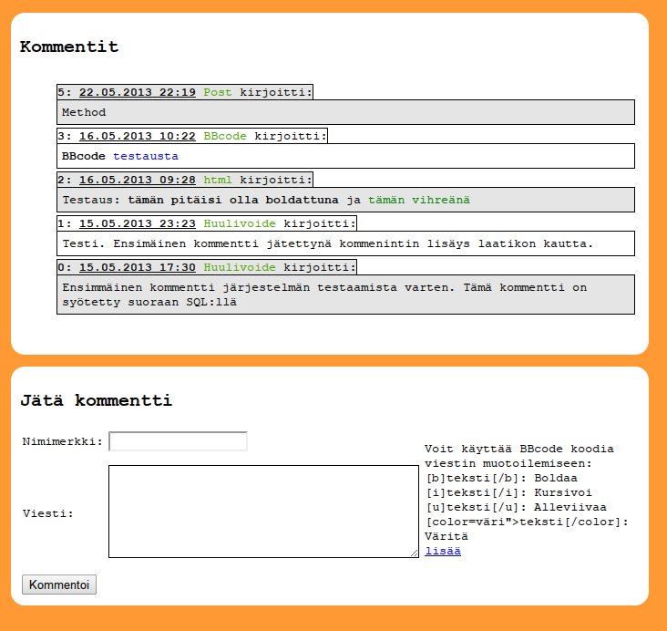

#pieme

##About
A simple commenting system for websites written in Python.

Nothing fancy here. It lets one to write new post and read the old ones. No
support for registration or logins, just message and a free chose nick. It has
many flaws, but I am not going to fix them as this is meant for websites with
low amount of users.

##Requirements
*  __Python__: tested on 2.5.1, should work with newer versions of Python2 too
*  __Sqlite3__: Used to store the messages
*  __Python sqlite module__: This is part of Python suite itself.
*  __[bbcode](https://pypi.python.org/pypi/bbcode)__: External module used to 
   add support for some minor message formatting.
*  __cgi__ capable web server

##Directories
*  __html__: HTML code snippets needed to embed the posting mechanism and message 
   display to the site.
*  __css__: CSS style sheets with comments on how to customize the message 
   display. Feel free to write your own, but you can use this as a reference.

##TODO
*  Add support for localization. Currently Finnish only
*  Add a simple interface for removing possibly offending/hazardous messages 
   currently needs direct access to the DB file.
*  Consider using a template engine for better control. Currently assumes 
   messages to be displayed inside a iframe, and does some assumptions on CSS
   file locations.
*  Add some smilies ^_^

##Preview

